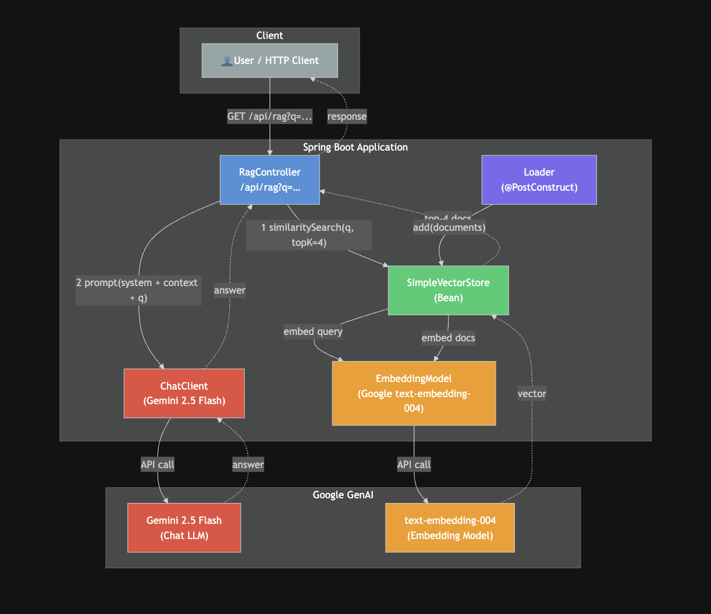

# Spring AI RAG with Vector Search and Gemini 2.5

## Run
1. Set your Google API key in `application.yaml`
2. mvn clean install
3. mvn spring-boot:run

## Test
GET http://localhost:8080/api/rag?q=funny
Body: plain text prompt

## UI
Open [http://localhost:8080](http://localhost:8080) in your browser after starting the app.

### Ask a question
Type your question in the search bar and press **Ask** or hit Enter.  
The answer is retrieved from the vector store and generated by Gemini 2.5 Flash.

### Answer card
The response is displayed in a card below the search bar.

> **Adding screenshots:** run the app, capture the two states above, and save them as  
> `docs/ui-search.png` and `docs/ui-answer.png` in the project root.

# Configuring API Key Access
https://aistudio.google.com/api-keys

# Flow Diagram

# High-Level Overview

